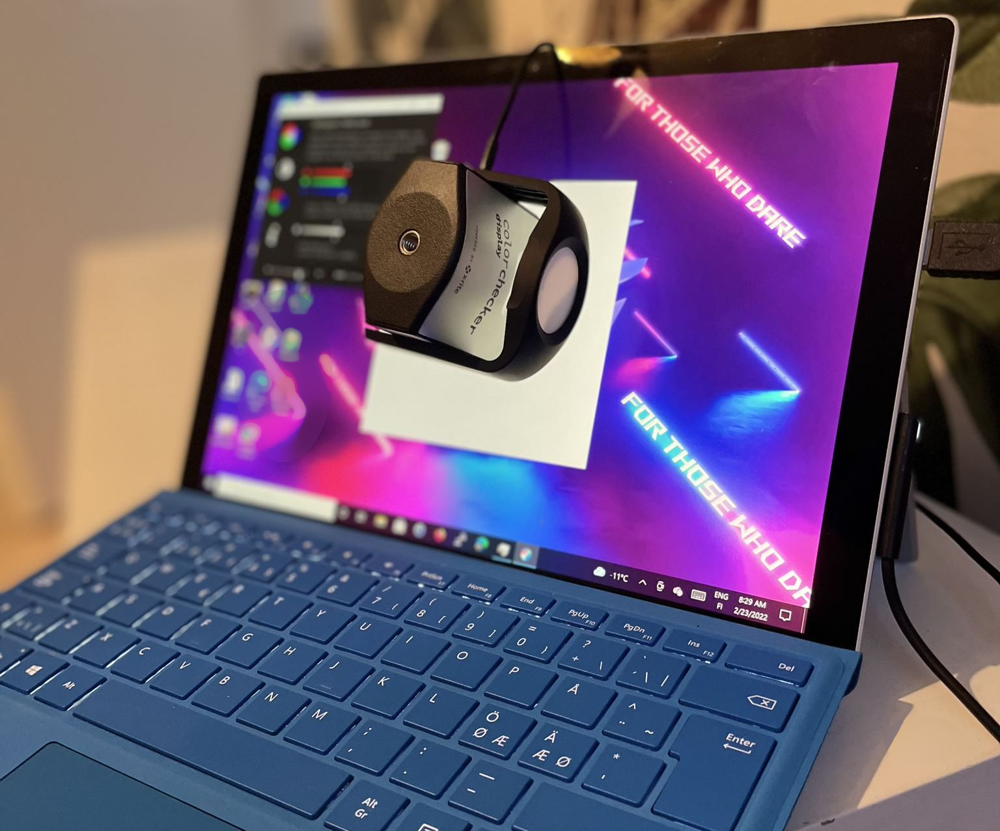

# Display experiences and eye comfort on various panel types
- [Display experiences and eye comfort on various panel types](#display-experiences-and-eye-comfort-on-various-panel-types)
  - [Disclaimer](#disclaimer)
  - [Personal (subjective preferences)](#personal-subjective-preferences)
    - [Panel types and subjective experiences](#panel-types-and-subjective-experiences)
      - [Black level](#black-level)
      - [SRGB coverage](#srgb-coverage)
  - [Measurement results](#measurement-results)
    - [Measurement device](#measurement-device)

## Disclaimer
I am not an medical professional nor eye health specialist. All opinions presented here are purely subjective, and likely influenced by tech and devices I've become used to over years

## Personal (subjective preferences)

I do mostly programming and documentation on my devices. So reading and writing text on VSCode, web blog and Word is my typical use case.

### Panel types and subjective experiences
My personal preference is the AAS type IPS panels from CMN/Innolux which I've been using with various laptops for past 3-4 years. Can't quite describe it, but it feels like the panel techs "geometry" for the lack of better word suits my eyes. Certain display types seem "flat", as if the there is something irritating "pushing" throug the white color. 

**Experiences besides AAS type panels**

- ✅ LG / Philips (IPS)
  - Seems to fit for my use just as well as AAS type panels
- ✅ AUO Optronics (AHVA)
  - Use it as one of my desktop displays
- ✅ Lenovo thinkvision displays (IPS, but panel manufacturer not defined)
  - Use it as one of my desktop displays
- ❌ BOE (IPS-ADS/HADS)
    - Causes immediate irritation. [Tested on Zephyrus G15](https://www.reddit.com/r/ZephyrusG15/comments/sror1n/zephyrus_g15_ga503qm_panel_now_boe_was_innolux/) and Lenovo Legion Slim 7
- ❌ Sharp (IPS-["New Mode2"]((https://www.panelook.com/LP123WQ1-SPA1_LG%20Display_12.3_LCM_overview_51959.html)))
    - Causes immediate irritation. Tested on x13 flow (Which is now used server desktop, and with external display)
- ❌ LEN140WQ+, (Lenovo Yoga Pro)
    - Causes immediate irritation 
    - The oled model (with samsung Panel) did cause less irritation, though it comes with PWM, but I can't confirm if my eyes are sensitive to it

#### Black level
Optimal Black level for me at 100-120 cd/m² brightness is anything below 0.13-0.15 cd/m²

#### SRGB coverage
Color accuracy is not big factor, neither SRGB coverage (Anything after 60% becomes fairly acceptable, with certain subjective levels of color deviations )

## Measurement results

### Measurement device
Calibrite display (Former X-rite DisplayPro)

All measurements are done at 80-120 cd/m2 as it is the level of brightness I typically would compare to something printed.

*"The brightness of your monitor, if set too high will tire your eyes and misrepresent the actual brightness of your images. Get it set between 80-120cd/m2, it will become way more comfortable to work, specially for those who spend long hours in front of the monitor and it will match the correct brightness of your images."* [reference](https://www.imageprintcentre.co.uk/blog-1/color-calibrate-your-monitor-for-printing-purposes)

Panel | contrast | black level | Gamut  srgb | luminance | notes | tech 
-|-|-|-|-|-|-
|N156HCE-EN1 (MSI Prestige) | 1064:1| 0.0926 cd/m²|88.3%|98.5 cd/m²| Great display for long hours at desktop| [IPS-AAS](https://www.panelook.com/N156HCE-EN1_Innolux_15.6_LCM_parameter_30969.html)
N156HRA-EA1 (Asus Rog Zephyrus G15) | 1501:1 | 0.0658 cd/m² | 65~% | 	98.5 cd/m² | Great display for long hours at desktop. | [IPS-AAS](https://www.panelook.com/N156HRA-EA1_Innolux_15.6_LCM_overview_45768.html)
LQ134N1JW52 (Asus Rog X13 Flow) | 1296:1 |  0.0754 cd/m² | 94.6% |98.9 cd/m² |  **Causes severe eye-strain** | [IPS "New Mode2"](https://www.panelook.com/LQ134N1JW52__13.4__overview_52219.html)
LP123WQ1 (Surface 2017 Pro)|TBD||TBD |TBD| Great display, no eye strain | [IPS](https://www.panelook.com/LP123WQ1-SPA1_LG%20Display_12.3_LCM_overview_51959.html)
