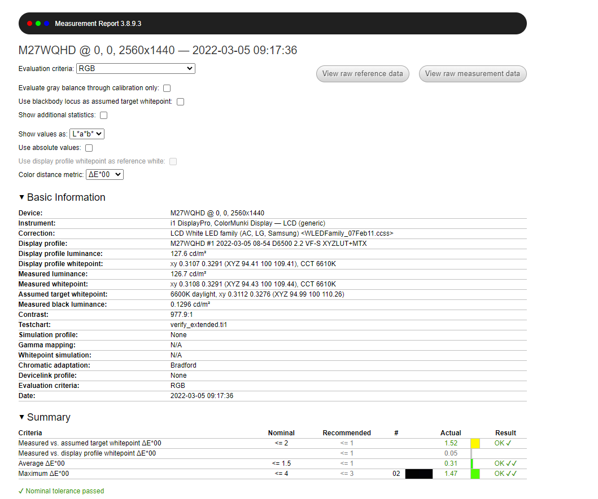
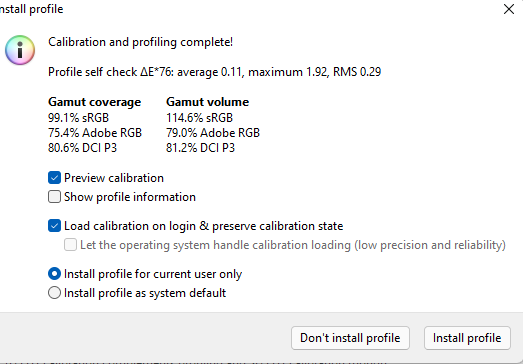
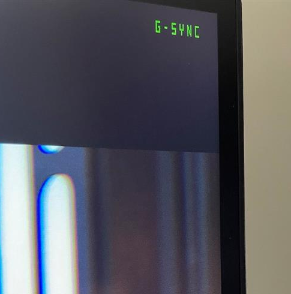

# This list has reviews for some screen devices I've tested

- [This list has reviews for some screen devices I've tested](#this-list-has-reviews-for-some-screen-devices-ive-tested)
  - [Verkkokauppa.com Bluecloud (M27WQHD)](#verkkokauppacom-bluecloud-m27wqhd)
    - [Pros and cons](#pros-and-cons)
    - [Measurements](#measurements)
      - [results out-of-the box](#results-out-of-the-box)
      - [Calibrated results](#calibrated-results)
      - [Testing freesync (non certified G-Sync compatible)](#testing-freesync-non-certified-g-sync-compatible)

## Verkkokauppa.com Bluecloud (M27WQHD)
This is a "white label" product from Verkkokauppa.com [ Bluecloud (M27WQHD)](https://www.verkkokauppa.com/fi/product/720962/Bluecloud-M27WQHD-27-WQHD-naytto)

Judging by the specifications and visual appearance (table stand, back of the device) it seems to be same product as [Pixio PX275C](https://www.amazon.com/Pixio-Displayport-Charging-FreeSync-Productivity/dp/B09M56MQ7R?th=1)

- IPS Panel
- 100Hz refresh rate
- 1440p 
- 1 x HDMI 1.4, 1 x DisplayPort 1.2, USB-C (Gen 3.1, Power Delivery 65 W)
- 90% DCI-P3
  - Please note, that the measurements for this review were done targeting standard SRGB range, where it achieves 99.1% SRGB. Activating the wide gamut likely exceeds this number.
- Freesync 
  - The verkkokauppa.com specification omits this, but it just like its sibling [Pixio PX275C](https://www.amazon.com/Pixio-Displayport-Charging-FreeSync-Productivity/dp/B09M56MQ7R?th=1), 

### Pros and cons

**Pros**
- USB-C Power Delivery 65w
  - ✅ USB-C with PD is basically non-existent in 16:9 high refresh rate screens
- Good contrast and black level for the price range
- Relatively accurate colors
- Great bezel-less design (non-gamery) - Good for work use, no blinking leds :) 
- Even backlight and light uniformity (subjective opinion)
- 100 hz refresh for gaming is great upgrade from comparable USB-C (60hz) equiped monitors
- No external power supply (easier for cable management)
  
**Cons**

Based on the pricing of this screen (469€ incl. VAT 24%) I wouldn't really list any cons :)
- No USB Hub, even though there is USB-C PD and DATA
- I did found one dead pixel on the screen, but since other attributes of the screen even screen uniformity is so good, I think it's acceptable given the price range.

### Measurements

#### results out-of-the box

Panel manufact | contrast | black level | Gamut  srgb | luminance |
-|-|-|-|-|
Unknown | 1057:1| 0.1602 cd/m²|99.1% |98.5 cd/m²

#### Calibrated results

**Measurement device and software**
Calibrite display (Former X-rite DisplayPro) and [displayCal](https://displaycal.net/)

#### Testing freesync (non certified G-Sync compatible)
I did a brief test with the NVIDIA GSYNC indicator to see if the G-Sync would be working. Opposed to the verkkokauppa.com specification the freesync indeed seems to be working.
  - Test was done with USB-C data connection

